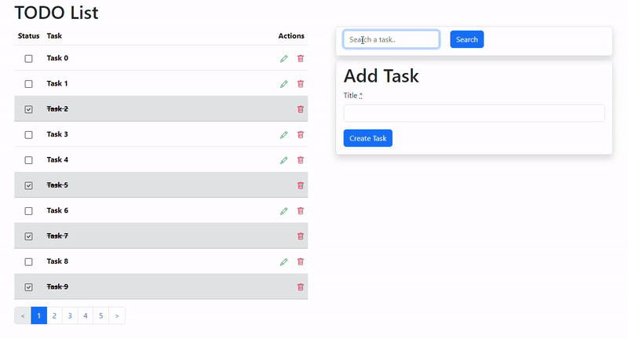
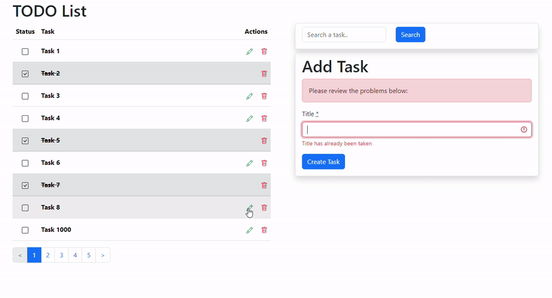

# TODO List

Quick demonstration of the power of Hotwire: a TODO application where you can create, edit, and remove tasks, as well as change their state to completed, all in a single-page application (SPA) fashion without writing any JavaScript. It also features pagination with the Pagy gem, integrated with Turbo Frames, and includes a basic search function using Stimulus.

Please note, this is a practical example based on my understanding of Hotwire. It is not necessarily "the way" to do it, but it serves as a starting point for those who need a simple example.

Suggestions and improvements are welcome.

## Demo Video

## Reference Information

- [Turbo Handbook](https://turbo.hotwired.dev/handbook/introduction)
- [Hotrails Turbo Tutorial](https://www.hotrails.dev/turbo-rails)
- [Mix & GO Rails - Hotwire videos](https://www.youtube.com/watch?v=4MUEQVxUbm4&list=PLBhH0uX92r6oiwiLBjdE-3NNsyRqyLAV9)
